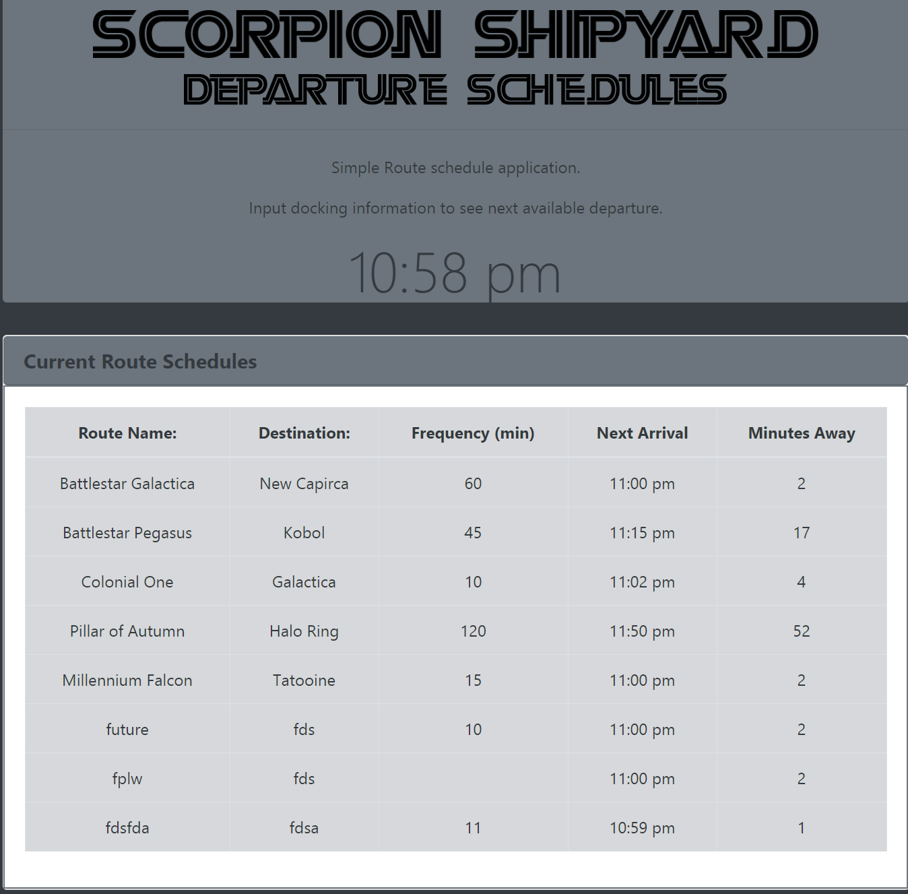
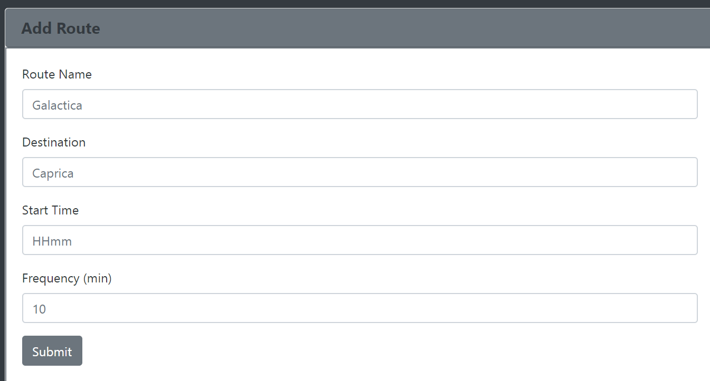

#Route Schedules


Created a psychic game where the user tries to guess a random letter in 9 guesses.

# Link to deployed site


[Website](https://atton88.github.io/Train-Scheduler/)

[GitHub Profile](https://github.com/atton88)

# Images





# technology used

- HTML
- CSS
- JavaScript
- Bootstrap CDN
- jQuery
- Firebase (online data storage)
- Moment js (time manipulation)

# code snippets

Moment js was a little tought to figure out, but it ended up being pretty simple once I understood it. This ended up being most of the code that I needed to figure out the next route time.
```
if (timeNow.diff(startTime, "m") > 0) {
    while (timeNow.diff(startTime, "m") > 0) {
        startTime.add(frequency, "m");
    }
}
```

# Learning points
- Learned to integrate Firebase into website
    - Allow multiple connections
    - Save data on Firebase

- Learned to use moment js to format times and manipulate them

# Author 
[Andrew Ton](https://github.com/atton88)